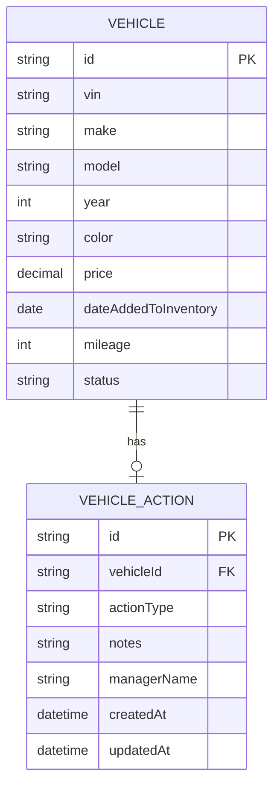

# Scenario B: The Intelligent Inventory Dashboard — Detailed Analysis

## 1. Overview

| Attribute | Detail |
|-----------|--------|
| **Domain** | Supply |
| **Task** | Build an Intelligent Inventory Dashboard for dealership managers |
| **Goal** | Real-time overview of vehicle stock with aging identification and actionable insights |

---

## 2. Core Requirements Breakdown

### Requirement 1: Inventory Visualization
- **What**: Display a **filterable list** of all vehicles in a dealership's inventory
- **Filter criteria explicitly mentioned**: make, model, age
- **Key design decision needed**: What other filters to support (price range, color, fuel type, etc.) — document as assumptions
- **Acceptance**: User must be able to apply filters and see a narrowed result set in real-time

### Requirement 2: Aging Stock Identification
- **What**: Automatically identify and **prominently display** "aging stock" — vehicles in inventory for **>90 days**
- **Critical word**: "prominently" — this means the UI must make aging vehicles visually distinct (e.g., badges, color highlights, dedicated section, or sorting priority)
- **Business rule**: `daysInInventory > 90` — the "date added to inventory" field is essential; document assumptions if not provided by data source
- **Acceptance**: Any vehicle with >90 days in inventory must be visually distinguishable from non-aging stock

### Requirement 3: Actionable Insights
- **What**: Allow a manager to **log and persist** a status or proposed action for each aging vehicle
- **Example given**: "Price Reduction Planned"
- **Key word**: "persist" — the action must survive page reload / server restart (requires database, not just client state)
- **Acceptance**: Manager can attach an action/status to an aging vehicle, and that action is retrievable later

---

## 3. Ambiguities & Assumptions to Document

The assessment explicitly says to document assumptions. For Scenario B, key ambiguities include:

| Ambiguity | Suggested Assumption |
|-----------|---------------------|
| What constitutes "age" of a vehicle in inventory? | `currentDate - dateAddedToInventory`; not the vehicle's manufacturing year |
| What does "prominently displayed" mean? | Dedicated aging stock section + visual badges/highlights in the main list |
| What status/action values are allowed? | Predefined enum (e.g., "Price Reduction Planned", "Transfer to Another Dealership", "Auction", "No Action") plus optional free-text notes |
| Is the dashboard for a single dealership or multi-dealership? | Single dealership (simpler; document if assuming multi) |
| What vehicle attributes are available? | VIN, make, model, year, color, price, dateAddedToInventory, mileage, status |
| How is "real-time" achieved? | Polling interval or WebSocket — document your approach |
| Can non-aging vehicles have actions logged? | Requirement says "for each aging vehicle" — scope to aging stock only, but could extend |

---

## 4. Architecture Recommendations

### Backend Option (strong for data logic)

```
[API Controller] → [Inventory Service] → [Repository Layer]
                       ↓              ↓
                [Filter Service]   [Aging Calculator]
                       ↓
                [Insight Service] → [Action Repository]
```

**Key components**:
- **Inventory Service**: Fetches and returns vehicle data
- **Filter Service**: Applies dynamic filtering (make, model, age range, etc.)
- **Aging Calculator**: Computes `daysInInventory` and flags vehicles >90 days
- **Insight Service**: Handles CRUD for manager actions/statuses on aging vehicles

**API endpoints** (suggested):

| Method | Path | Description |
|--------|------|-------------|
| `GET` | `/api/inventory` | List all vehicles with optional filters |
| `GET` | `/api/inventory/aging` | Get aging stock (>90 days) |
| `POST` | `/api/inventory/{id}/action` | Log an action for an aging vehicle |
| `PUT` | `/api/inventory/{id}/action` | Update an existing action |
| `GET` | `/api/inventory/{id}/action` | Get the action for a specific vehicle |

### Frontend Option (strong for visualization)

- **React + TailwindCSS + shadcn/ui** — modern stack for dashboard UI
- **Data table component** with sortable/filterable columns
- **Aging stock section** — highlighted cards or a dedicated panel with visual badges
- **Action modal** — form to log/update actions per aging vehicle
- **Mock backend** — `json-server` or MSW for API simulation

---

## 5. Data Model



**Key points**:
- `dateAddedToInventory` is critical — drives the aging calculation
- `VEHICLE_ACTION` is a separate entity (one-to-one or one-to-many with vehicle)
- Action only applies to aging vehicles per requirements

---

## 6. Diagram Focus Areas (for System Design Document)

Per the verified insights document:
> **Scenario B**: Emphasize data filtering pipeline, aging calculation logic, and action persistence flow.

**Required diagrams**:

1. **Context Diagram** (C4 Level 1)
   ```
   [Dealership Manager] → [Inventory Dashboard] ← [Vehicle Database]
                         ↓
                   [Aging Stock Service]
   ```

2. **Container Diagram** (C4 Level 2)
   ```
   [Web Browser] → [React Frontend] → [Node.js/Java Backend] → [H2/PostgreSQL]
                                     ↓
                              [Aging Stock Service]
   ```

3. **Component Diagram** (Backend Focus)
   ```
   [API Controller] → [Inventory Service] → [Repository Layer]
                      ↓              ↓
               [Filter Service]   [Aging Calculator]
                      ↓
               [Insight Service]
   ```

4. **Sequence Diagrams** — Key flows:
   - Filter request → service → DB → filtered results → UI
   - Aging query → aging calculator → DB → flagged results → prominent display
   - Action logging → insight service → action repository → confirmation

---

## 7. Testing Strategy

**Core business logic to test**:
- ✅ Aging calculation: vehicle with 91 days → flagged as aging; 90 days → NOT aging
- ✅ Filtering: filter by make returns only matching vehicles; combined filters work correctly
- ✅ Action persistence: log an action, retrieve it, verify it survives data reload
- ✅ Edge cases: empty inventory, all vehicles aging, no vehicles aging, invalid filter values

---

## 8. Observability Strategy

| Area | Implementation |
|------|---------------|
| **Logging** | Structured JSON logs with correlation IDs; log filter queries, aging calculations, action CRUD |
| **Metrics** | Inventory size gauge, aging stock count, filter query latency, action logging rate |
| **Tracing** | Trace filter requests end-to-end; trace action persistence flow |
| **Health** | `/health` endpoint checking DB connectivity |

---

## 9. Scenario B Strengths & Risks

### Strengths
- **Medium complexity** — achievable within the estimated 15-25 hour window
- **Strong frontend showcase** — data visualization, filtering UX, prominent display design
- **Clear business logic** — aging calculation is straightforward; no concurrency challenges like Scenario A
- **Well-scoped** — three requirements are distinct and testable

### Risks
- **"Prominently displayed" is subjective** — under-delivering on visual emphasis could lose points; over-engineering could waste time
- **Real-time data refresh** — if you claim "real-time" in the design, you need a strategy (polling vs WebSocket) and should implement it
- **Filtering performance** — with large datasets, server-side filtering is important; client-side filtering won't scale
- **Action persistence** — easy to overlook; must use a genuine persistent store (not just `localStorage`)

---

## 10. Scenario B: Backend vs Frontend Fit

| Scenario | Backend Focus? | Frontend Focus? |
|----------|----------------|-----------------|
| **B** | Good | **Strong choice** |

Scenario B naturally lends itself to a **frontend implementation** because:
- The core value is in **visualization and interaction** (filterable list, prominent display, action logging UI)
- The backend is relatively simple CRUD + a date comparison
- A polished, interactive dashboard demonstrates strong technical execution and communication

If choosing **backend instead**, focus on: robust filtering API, efficient aging calculation query (SQL `DATEDIFF`), and clean action persistence with validation.

---

## 11. Summary

Scenario B is well-scoped with three clear, testable requirements. The main design decisions revolve around what "prominently displayed" means, how to handle real-time updates, and what action types to support. Document all assumptions, implement the aging calculation correctly (>90 days, not ≥90), and ensure action persistence uses a genuine persistent store.
